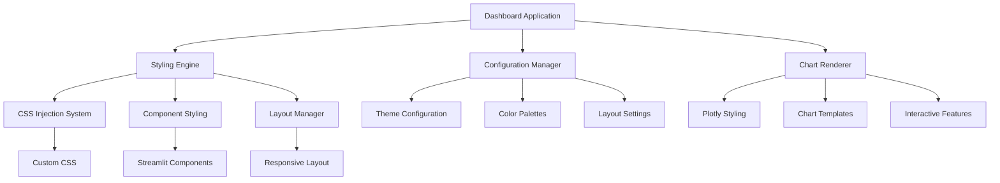

# Design Document

## Overview

This design document outlines the comprehensive styling and configuration system for the Pakistan Data Twin Dashboard. The solution focuses on creating a professional, maintainable, and visually appealing interface through centralized configuration management, consistent theming, and enhanced user experience components.

## Architecture

### High-Level Architecture



### Core Design Principles

1. **Centralized Configuration**: All styling decisions managed through a single configuration system
2. **Modular Architecture**: Separate styling concerns from business logic
3. **Responsive Design**: Adaptive layout for different screen sizes
4. **Accessibility First**: Color-blind friendly palettes and keyboard navigation
5. **Performance Optimized**: Efficient CSS injection and minimal overhead

## Components and Interfaces

### 1. Configuration Manager (`src/styling/config.py`)

**Purpose**: Centralized management of all styling configurations

**Key Features**:
- Theme definitions with color palettes
- Layout configuration parameters
- Chart styling templates
- Validation and error handling

**Interface**:
```python
class StylingConfig:
    def get_theme(theme_name: str) -> Dict
    def get_color_palette(palette_name: str) -> Dict
    def get_layout_config() -> Dict
    def validate_config(config: Dict) -> bool
```

### 2. Styling Engine (`src/styling/engine.py`)

**Purpose**: CSS injection and component styling management

**Key Features**:
- Dynamic CSS generation and injection
- Component-specific styling application
- Theme switching capabilities
- Custom CSS override support

**Interface**:
```python
class StylingEngine:
    def inject_css(css_content: str) -> None
    def apply_theme(theme_name: str) -> None
    def style_component(component_type: str, styles: Dict) -> None
    def generate_css_from_config(config: Dict) -> str
```

### 3. Enhanced Chart Renderer (`src/styling/charts.py`)

**Purpose**: Styled chart generation with consistent theming

**Key Features**:
- Theme-aware chart generation
- Enhanced interactivity and animations
- Accessibility-optimized color schemes
- Consistent styling across chart types

**Interface**:
```python
class StyledChartRenderer:
    def create_styled_chart(data: DataFrame, chart_type: str, theme: str) -> Figure
    def apply_chart_theme(fig: Figure, theme: Dict) -> Figure
    def add_interactivity(fig: Figure, config: Dict) -> Figure
    def optimize_for_accessibility(fig: Figure) -> Figure
```

### 4. Layout Manager (`src/styling/layout.py`)

**Purpose**: Responsive layout and spacing management

**Key Features**:
- Grid-based layout system
- Responsive breakpoints
- Dynamic spacing calculations
- Component positioning utilities

**Interface**:
```python
class LayoutManager:
    def create_responsive_columns(breakpoints: Dict) -> List
    def apply_spacing(component: str, spacing_config: Dict) -> None
    def calculate_dynamic_sizing(screen_size: str) -> Dict
    def optimize_layout_for_content(content_type: str) -> Dict
```

## Data Models

### Theme Configuration Model

```python
@dataclass
class ThemeConfig:
    name: str
    primary_color: str
    secondary_color: str
    accent_color: str
    background_color: str
    text_color: str
    chart_colors: List[str]
    font_family: str
    border_radius: int
    shadow_config: Dict
```

### Layout Configuration Model

```python
@dataclass
class LayoutConfig:
    container_max_width: str
    sidebar_width: str
    header_height: str
    footer_height: str
    spacing_unit: int
    breakpoints: Dict[str, int]
    grid_columns: int
```

### Chart Styling Model

```python
@dataclass
class ChartStylingConfig:
    template: str
    color_sequence: List[str]
    font_config: Dict
    margin_config: Dict
    hover_config: Dict
    animation_config: Dict
    accessibility_config: Dict
```

## Error Handling

### Configuration Validation

1. **Theme Validation**: Ensure all required theme properties are present and valid
2. **Color Validation**: Verify color codes are valid hex/rgb values
3. **Layout Validation**: Check layout dimensions and breakpoints are reasonable
4. **Fallback Mechanisms**: Default to safe configurations when validation fails

### CSS Injection Safety

1. **CSS Sanitization**: Validate CSS content before injection
2. **Error Isolation**: Prevent styling errors from breaking the application
3. **Graceful Degradation**: Fall back to default Streamlit styling if custom styles fail

### Chart Rendering Resilience

1. **Data Validation**: Ensure chart data is properly formatted before styling
2. **Theme Fallbacks**: Use default Plotly themes if custom themes fail
3. **Performance Monitoring**: Track rendering performance and optimize as needed

## Testing Strategy

### Unit Testing

1. **Configuration Tests**: Validate theme and layout configurations
2. **CSS Generation Tests**: Ensure CSS is generated correctly from configurations
3. **Chart Styling Tests**: Verify chart themes are applied properly
4. **Layout Tests**: Test responsive layout calculations

### Integration Testing

1. **End-to-End Styling**: Test complete styling pipeline from config to display
2. **Theme Switching**: Verify smooth transitions between themes
3. **Responsive Behavior**: Test layout adaptation across screen sizes
4. **Cross-Browser Compatibility**: Ensure styling works across different browsers

### Visual Regression Testing

1. **Screenshot Comparisons**: Automated visual testing for styling consistency
2. **Chart Appearance**: Verify chart styling remains consistent across updates
3. **Layout Integrity**: Ensure layout doesn't break with content changes

## Implementation Details

### File Structure

```
src/
├── styling/
│   ├── __init__.py
│   ├── config.py          # Configuration management
│   ├── engine.py          # CSS injection and styling
│   ├── charts.py          # Enhanced chart rendering
│   ├── layout.py          # Layout management
│   ├── themes/
│   │   ├── professional.py
│   │   ├── dark.py
│   │   └── accessible.py
│   └── assets/
│       ├── custom.css
│       └── fonts/
├── app/
│   └── main.py           # Updated with styling integration
└── config.py             # Updated with styling configs
```

### CSS Architecture

1. **Base Styles**: Core styling for Streamlit components
2. **Theme Styles**: Theme-specific color and typography rules
3. **Component Styles**: Specific styling for dashboard components
4. **Utility Styles**: Helper classes for spacing, alignment, etc.
5. **Responsive Styles**: Media queries for different screen sizes

### Performance Considerations

1. **CSS Minification**: Compress CSS for faster loading
2. **Selective Injection**: Only inject necessary CSS for current theme
3. **Caching**: Cache generated CSS to avoid regeneration
4. **Lazy Loading**: Load theme assets only when needed

### Accessibility Features

1. **Color Contrast**: Ensure WCAG AA compliance for all color combinations
2. **Focus Indicators**: Clear focus states for keyboard navigation
3. **Screen Reader Support**: Proper ARIA labels and semantic markup
4. **Color-Blind Friendly**: Use patterns and shapes in addition to colors

### Browser Compatibility

1. **Modern Browser Support**: Target Chrome, Firefox, Safari, Edge
2. **CSS Fallbacks**: Provide fallbacks for newer CSS features
3. **Progressive Enhancement**: Core functionality works without advanced styling
4. **Mobile Optimization**: Touch-friendly interfaces and responsive design